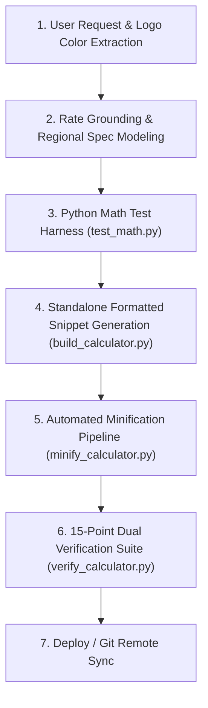

# Global WordPress Cost Calculator Builder Skill

This skill provides an autonomous end-to-end framework to build high-converting, localized, standalone WordPress cost calculator widgets for any trade, service, product, or industry (demolition, roofing, masonry, concrete, HVAC, plumbing, solar, remodeling, commercial services).

---

## 1. Mandatory Design & Branding Directives (STRICT ENFORCEMENT)

When creating, updating, or generating any WordPress cost calculator, ALWAYS enforce the following strict rules:

### A. Deep Logo Color Analysis & Dual-Color Harmony
- **Visual Inspection**: Thoroughly inspect the target website's logo image and extract the exact primary and secondary color palette (Hex codes).
- **Brand System Mapping**:
  - **Primary Logo Color**: Apply to primary action buttons, active select focus borders, header titles, hero price labels, main breakdown bar segments, and primary CTA cards.
  - **Secondary Logo Color**: Apply to secondary action buttons (click-to-call), labels, table text, legend tags, and structural dark accents.

### B. Centered Title-Only Header Section (STRICT MANDATE)
- **Centering (Universal)**: The top header section **MUST ALWAYS be centered** (`text-align: center; margin: 0 auto;`).
- **Title ONLY**: The header block contains **ONLY the centered Main Calculator Title** (`<h2 class="bcc-title">...</h2>`).
  ```html
  <div class="bcc-header-wrap">
    <h2 class="bcc-title">Swimming Pool Demolition Cost Calculator</h2>
  </div>
  ```
  ```css
  .bcc-header-wrap {
    text-align: center !important;
    margin: 0 auto 16px auto !important;
    max-width: 100% !important;
  }
  .bcc-title {
    text-align: center !important;
    margin: 0 auto !important;
    font-size: 19px !important;
    font-weight: 800 !important;
    color: var(--bcc-secondary) !important;
    line-height: 1.25 !important;
    letter-spacing: -0.02em !important;
  }
  @media (min-width: 480px) {
    .bcc-title {
      font-size: 21px !important;
    }
  }
  ```
- **REVOKED & OMITTED**: Location badges and subtitles are **permanently removed/omitted** from the header block. They consume excessive vertical height and clutter narrow header-right columns.
- **FORBIDDEN**: NEVER include location badges or subtitles in the top calculator header block. NEVER left-align or right-align the calculator title.

### C. Calculator Container Background (STRICT MANDATE)
- **Background Color**: You MUST **ONLY use `#FFFFFF`** (Pure White) as the background color code for all calculator containers (`background: #FFFFFF;` or `--card-bg: #FFFFFF;`).
- **FORBIDDEN**: NEVER use grey (`#F8FAFC`, `#F1F5F9`), dark, or tinted backgrounds for the main calculator container box.

### D. Universal Container Bounds & Multi-Device Fit
- **Container Max-Width**: Default MUST ALWAYS be `max-width: 100%` for fluid, flawless responsive rendering across PC header right areas, sidebars, body contents, and mobile viewports.
- **Scope Isolation**: Use CSS container queries (`container-type: inline-size;`) so the widget seamlessly re-flows whether placed in a 320px header right column, a 480px tablet sidebar, or full-width page body.

---

## 2. Input Form Controls & Layout Best Practices

### A. All-Dropdown Text-Type Architecture (Mandatory for Multi-Device Fit)
In narrow header right columns (300px–380px) or mobile viewports, horizontal button chip rows or pill toggle bars get squeezed, causing text truncation, stacking, or horizontal overflow.
- **Mandatory Text-Type Architecture**: Convert all multi-choice options (e.g., Demolition Method, Project Scope, Finish Type) into standard, clean `<select>` dropdowns.
- **Example**:
  ```html
  <div class="bcc-method-wrap">
    <div class="bcc-form-group">
      <label class="bcc-label" for="bcc-method-select">
        <span>Demolition Method</span>
        <span class="bcc-label-tag" id="bcc-method-tag">ASTM D1557 Backfill</span>
      </label>
      <select id="bcc-method-select" class="bcc-select" onchange="bccOnMethodChange()">
        <option value="full" selected>Full Removal (Recommended)</option>
        <option value="partial">Partial Demolition (Fill-In)</option>
      </select>
    </div>
  </div>
  ```

### B. Concise, Unclipped Dropdown Options (< 35 Characters)
In narrow columns, verbose dropdown option labels get truncated with `...` by the browser.
- **Strict Rule**: Keep all `<option>` text concise, plain-English, and strictly under 35 characters.
- **Examples**:
  - `Full Removal (Recommended)` (26 chars)
  - `Partial Demolition (Fill-In)` (28 chars)
  - `Small (~350 sq ft)` (18 chars)
  - `Medium (~500 sq ft)` (19 chars)
  - `Large (~650 sq ft)` (18 chars)
  - `Oversized (~850 sq ft)` (22 chars)
  - `Custom Area (Enter sq ft)` (25 chars)
  - `Gunite / Concrete Shell` (23 chars)
  - `Fiberglass Shell` (16 chars)
  - `Vinyl Liner (Steel/Wood)` (24 chars)
  - `Wide Access (10+ ft gate)` (25 chars)
  - `Standard Access (6-8 ft)` (24 chars)
  - `Narrow Access (< 5 ft)` (22 chars)

### C. Dropdown-First Surface Area Pattern & Hidden-by-Default Custom Stepper
- Provide standard area presets in the dropdown.
- Provide a `Custom Area (Enter sq ft)` option that toggles an interactive numeric stepper `[-] [ 500 ] sq ft [+]` directly below the dropdown.
- **Hidden by Default Protocol**:
  ```css
  .bcc-stepper-wrap {
    display: none;
    align-items: center !important;
    gap: 6px !important;
    margin-top: 6px !important;
    background: #F8FAFC !important;
    border: 1px dashed #CBD5E1 !important;
    border-radius: 7px !important;
    padding: 5px 6px !important;
  }
  .bcc-stepper-wrap.bcc-stepper-active {
    display: flex !important;
  }
  .bcc-stepper-btn {
    all: unset !important;
    box-sizing: border-box !important;
    width: 32px !important;
    height: 32px !important;
    min-width: 32px !important;
    max-width: 32px !important;
    background: #FFFFFF !important;
    border: 1.5px solid var(--bcc-border) !important;
    border-radius: 6px !important;
    display: flex !important;
    align-items: center !important;
    justify-content: center !important;
    cursor: pointer !important;
    font-size: 17px !important;
    font-weight: 700 !important;
    color: var(--bcc-primary) !important;
    transition: all 0.15s ease !important;
    user-select: none !important;
  }
  .bcc-stepper-btn:hover {
    background: var(--bcc-primary) !important;
    color: #FFFFFF !important;
    border-color: var(--bcc-primary) !important;
  }
  ```

### D. Container Query & 2-Column Responsive Anti-Truncation Grid
NEVER use a 3-column row for dropdowns. Enforce a dynamic 2-column grid that automatically stacks to 1-column on narrow containers:
```css
.bcc-grid-2col {
  display: grid !important;
  grid-template-columns: 1fr !important;
  gap: 11px !important;
  margin-bottom: 16px !important;
}
@container (min-width: 380px) {
  .bcc-grid-2col {
    grid-template-columns: repeat(2, 1fr) !important;
    gap: 12px 14px !important;
  }
}
@media (min-width: 440px) {
  .bcc-grid-2col {
    grid-template-columns: repeat(2, 1fr) !important;
    gap: 12px 14px !important;
  }
}
```

### E. Elementor & WordPress Theme-Immune Dropdowns (STRICT ANTI-CLIPPING MANDATE)
Themes like Astra, Divi, and Elementor inject fixed heights (e.g. `height: 38px !important;`) onto `<select>` and `<input>`. Applying vertical padding pushes text down, cutting off descenders.
- **Mandatory Anti-Clipping Rule**:
  - Always enforce **ZERO vertical padding** (`padding: 0 36px 0 12px !important;`).
  - Set explicit matching height and line-height: `height: 42px !important; min-height: 42px !important; max-height: 42px !important; line-height: 40px !important;`.
  - Always specify:
    ```css
    .bcc-select {
      all: unset !important;
      box-sizing: border-box !important;
      width: 100% !important;
      height: 42px !important;
      min-height: 42px !important;
      max-height: 42px !important;
      line-height: 40px !important;
      padding: 0 36px 0 12px !important;
      border: 1.5px solid var(--bcc-border) !important;
      border-radius: 8px !important;
      background-color: #FFFFFF !important;
      background-image: url("data:image/svg+xml,%3Csvg xmlns='http://www.w3.org/2000/svg' fill='none' viewBox='0 0 20 20'%3E%3Cpath stroke='%23475569' stroke-linecap='round' stroke-linejoin='round' stroke-width='1.6' d='m6 8 4 4 4-4'/%3E%3C/svg%3E") !important;
      background-repeat: no-repeat !important;
      background-position: right 10px center !important;
      background-size: 16px 16px !important;
      font-size: 12.5px !important;
      font-weight: 500 !important;
      color: var(--bcc-secondary) !important;
      cursor: pointer !important;
      display: block !important;
      vertical-align: middle !important;
      overflow: hidden !important;
      text-overflow: ellipsis !important;
      white-space: nowrap !important;
      transition: border-color 0.15s ease, box-shadow 0.15s ease !important;
    }
    .bcc-select:focus {
      border-color: var(--bcc-primary) !important;
      box-shadow: 0 0 0 3px rgba(230, 81, 0, 0.12) !important;
      outline: none !important;
    }
    ```

---

## 3. Results Architecture: Lightbox Modal Pop-Up Protocol

When the user clicks "Calculate Estimate", launch a clean, high-converting modal results dialog:

### A. Anti-Cascade Specificity Protocol (CRITICAL FIX FOR "RESULTS NOT SHOWING")
- **NEVER use inline `style="display: none !important;"` on the overlay HTML tag**:
  - In W3C CSS cascading specificity, an inline style with `!important` completely overrides stylesheet rules, permanently trapping the modal in a hidden state.
- **Mandatory Clean HTML Tag**:
  ```html
  <div id="bcc-results-modal" class="bcc-modal-overlay" onclick="bccOnBackdropClick(event)">
  ```
- **Mandatory Base CSS**:
  ```css
  #bcc-results-modal,
  .bcc-modal-overlay {
    display: none !important;
    position: fixed !important;
    top: 0 !important;
    left: 0 !important;
    width: 100vw !important;
    height: 100vh !important;
    background: rgba(15, 23, 42, 0.72) !important;
    backdrop-filter: blur(4px) !important;
    -webkit-backdrop-filter: blur(4px) !important;
    z-index: 99999999 !important;
    align-items: center !important;
    justify-content: center !important;
    padding: 12px !important;
    box-sizing: border-box !important;
  }
  #bcc-results-modal.bcc-modal-active,
  .bcc-modal-overlay.bcc-modal-active {
    display: flex !important;
    animation: bccFadeIn 0.2s ease-out forwards !important;
  }
  ```
- **Mandatory Launch & Dismiss JavaScript Pattern**:
  ```javascript
  // On Launch:
  var modal = document.getElementById('bcc-results-modal');
  if (modal) {
    modal.style.removeProperty('display');
    modal.style.setProperty('display', 'flex', 'important');
    modal.classList.add('bcc-modal-active');
    startCountdown();
  }
  document.body.style.overflow = 'hidden';

  // On Dismiss:
  var modal = document.getElementById('bcc-results-modal');
  if (modal) {
    modal.classList.remove('bcc-modal-active');
    modal.style.removeProperty('display');
    modal.style.setProperty('display', 'none', 'important');
    stopCountdown();
  }
  document.body.style.overflow = '';
  ```

### B. Astra-Immune Circular Close Button
```css
#bcc-results-modal .bcc-close-btn,
button.bcc-close-btn,
.bcc-close-btn {
  all: unset !important;
  box-sizing: border-box !important;
  position: absolute !important;
  top: 10px !important;
  right: 10px !important;
  width: 30px !important;
  height: 30px !important;
  min-width: 30px !important;
  max-width: 30px !important;
  min-height: 30px !important;
  max-height: 30px !important;
  padding: 0 !important;
  margin: 0 !important;
  background: #F1F5F9 !important;
  border: 1.5px solid #CBD5E1 !important;
  border-radius: 50% !important;
  display: inline-flex !important;
  align-items: center !important;
  justify-content: center !important;
  cursor: pointer !important;
  color: #1E293B !important;
  transition: all 0.18s ease !important;
  z-index: 10 !important;
  font-size: 15px !important;
  line-height: 1 !important;
  font-family: inherit !important;
}
.bcc-close-btn:hover {
  background: #E2E8F0 !important;
  color: #0F172A !important;
  transform: rotate(90deg) scale(1.05) !important;
}
```

### C. 5-Second Auto-Close Countdown with Hover Pause
- Top countdown progress bar shrinks from 100% to 0% over 5 seconds (5000ms).
- `onmouseenter="bccPauseTimer()"` pauses the countdown when the user hovers over the dialog.
- `onmouseleave="bccResumeTimer()"` resumes the countdown.
- Dismissible via click on backdrop overlay and `Escape` key listener.

### D. Dual Side-by-Side Conversion CTAs (Direct Lead Capture)
Enforce **side-by-side dual buttons** for maximum conversions on both desktop and mobile viewports:
```html
<div class="bcc-modal-actions">
  <a href="https://[client-domain]/contact-us/" class="bcc-cta-btn bcc-cta-primary" target="_blank" rel="noopener">
    <span>Book Free Site Walk</span>
  </a>
  <a href="tel:+19163185272" class="bcc-cta-btn bcc-cta-secondary">
    <span>Call (916) 318-5272</span>
  </a>
</div>
<div class="bcc-compliance-note">
  CSLB Class C-21 Lic #1094821 &bull; City &amp; County Standards
</div>
```
```css
.bcc-modal-actions {
  display: grid !important;
  grid-template-columns: 1fr 1fr !important;
  gap: 7px !important;
  margin-bottom: 9px !important;
}
.bcc-cta-btn {
  all: unset !important;
  box-sizing: border-box !important;
  display: flex !important;
  align-items: center !important;
  justify-content: center !important;
  gap: 5px !important;
  height: 38px !important;
  border-radius: 7px !important;
  font-size: 12px !important;
  font-weight: 700 !important;
  cursor: pointer !important;
  user-select: none !important;
  text-decoration: none !important;
  text-align: center !important;
  transition: all 0.15s ease !important;
}
.bcc-cta-primary {
  background: var(--bcc-primary) !important;
  color: #FFFFFF !important;
  box-shadow: 0 2px 6px rgba(230, 81, 0, 0.28) !important;
}
.bcc-cta-primary:hover {
  background: var(--bcc-primary-hover) !important;
  color: #FFFFFF !important;
}
.bcc-cta-secondary {
  background: var(--bcc-secondary) !important;
  color: #FFFFFF !important;
}
.bcc-cta-secondary:hover {
  background: var(--bcc-secondary-hover) !important;
  color: #FFFFFF !important;
}
```

### E. Revocation of Print Estimate Button & Engine (REVOKED DIRECTIVE)
- **Direct Lead Focus**: The unneeded "Print Isolated 1-Page Official Estimate (PDF)" button (`.bcc-print-btn`) and its iframe printing engine (`window.bccPrintEstimate`) are **permanently revoked and omitted**.
- **Rationale**: Eliminates bloated iframe DOM nodes, simplifies user attention, and funnels 100% of user intent into the dual conversion CTAs (**Book Free Site Walk** and **Call Now**).

---

## 4. 100% Valid Single-Root JSON-LD Schema Architecture

Every generated calculator MUST include a complete `@graph` JSON-LD schema with zero errors and zero warnings:
1. `WebSite`: Canonical site root.
2. `WebPage`: Hosted page containing the tool (`about` pointing to organization).
3. `WebApplication` / `SoftwareApplication`: Tool declaration with `$0.00` Free Online Utility offer, `aggregateRating`, and `featureList`.
4. `Service`: Specific trade service entity with disambiguated `areaServed` (Wikipedia and Wikidata Q-IDs).
5. `GeneralContractor` (or specific trade `@type`): Fully populated provider entity with phone, address, geo coordinates, opening hours, and official Google Knowledge Graph / Maps `sameAs` links.

---

## 5. Standard Operational Workflow & 15-Point Dual Verification Suite



### 15-Point Dual Verification Suite (`verify_calculator.py`)
Run automated assertions across both the formatted snippet and the minified production file:
1. **Centered Header Block**: Centered title ONLY (`<h2 class="bcc-title">...</h2>`). Location badge and subtitle cleanly omitted.
2. **Container Background**: Strictly `#FFFFFF` (Pure White).
3. **Universal Container Bounds**: Default `max-width: 100%`.
4. **Concise Dropdown Options**: All `<option>` labels strictly under 35 characters.
5. **Theme-Immune Dropdowns**: Height 42px, line-height 40px, zero vertical padding (`padding: 0 36px 0 12px !important;`).
6. **Anti-Cascade Specificity**: Modal overlay clean HTML tag with zero inline `display: none` blocking.
7. **Modal Active State**: `.bcc-modal-active` with `display: flex !important` and backdrop blur.
8. **Astra-Immune Circular Close Button**: `all: unset !important; border-radius: 50% !important;` 30px x 30px circular button.
9. **5-Second Countdown Timer**: Progress bar shrinks from 100% to 0% over 5s with `bccPauseTimer` hover pause.
10. **Direct Lead CTAs**: Verified links directly to `/contact-us/` and `tel:[phone]`.
11. **Print Button & Engine Revoked**: `.bcc-print-btn` and `bccPrintEstimate` cleanly omitted per user directive.
12. **100% Valid JSON-LD Schema**: Complete 5-entity `@graph` hierarchy.
13. **Hidden Stepper Protocol**: `.bcc-stepper-wrap` hidden by default; toggles active only on custom entry.
14. **2-Column Responsive Grid**: Balanced 2-column layout on containers $\ge$ 380px or viewports $\ge$ 440px.
15. **Both Files Validated**: 100% pass across formatted snippet AND minified production file.
