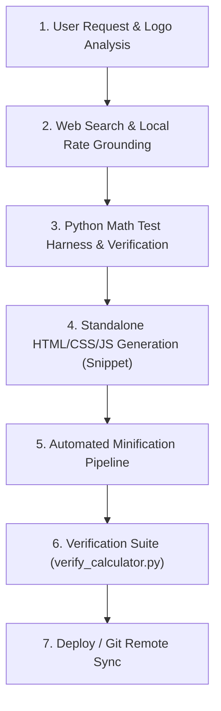

# Global WordPress Cost Calculator Builder Skill

This skill provides an autonomous end-to-end framework to build high-converting, localized, standalone WordPress cost calculator widgets for any trade, service, product, or industry (roofing, masonry, concrete, HVAC, plumbing, solar, remodeling, commercial services).

---

## 1. Mandatory Design & Branding Directives (STRICT ENFORCEMENT)

When creating, updating, or generating any WordPress cost calculator, ALWAYS enforce the following strict rules:

### A. Deep Logo Color Analysis & Dual-Color Harmony
- **Visual Inspection**: Thoroughly inspect the target website's logo image and extract the exact primary and secondary color palette (Hex codes).
- **Brand System Mapping**:
  - **Primary Logo Color**: Apply to primary action buttons, active tab/segmented pill backgrounds, header titles, focus borders, and main breakdown bar segments.
  - **Secondary Logo Color**: Apply to badges, highlight accents, active tab borders/indicators, legend tags, and secondary action elements.

### B. Centered Header Section (STRICT MANDATE)
- **Centering**: The header block (Main Calculator Title and Subtitle) **MUST ALWAYS be centered** (`text-align: center; margin: 0 auto;`).
- **Location Badge**: Optional location badge above the title can be included or removed per user preference while keeping the title centered.
- **Forbidden**: NEVER left-align or right-align the top calculator header title block.

### C. Calculator Container Background (STRICT MANDATE)
- **Background Color**: You MUST **ONLY use `#FFFFFF`** (Pure White) as the background color code for all calculator containers (`background: #FFFFFF;` or `--card-bg: #FFFFFF;`).
- **Forbidden**: NEVER use grey (`#F8FAFC`, `#F1F5F9`), dark, or tinted backgrounds for the main calculator container box.

### D. Universal Container Bounds
- **Container Max-Width**: Default MUST ALWAYS be `max-width: 100%` for fluid, flawless responsive rendering across PC header right areas, sidebars, body contents, and mobile viewports.

---

## 2. Input Form Controls & Layout Best Practices

### A. Concise, Unclipped Dropdown Options (< 35 Characters)
In narrow hero right columns or sidebar containers (~280px–340px), verbose dropdown option labels get truncated with `...` by the browser.
- **Rule**: Keep all `<option>` text concise, plain-English, and under 35 characters so the label is 100% visible before the dropdown arrow.
- **Example**:
  - *Poor*: `Class 4 Impact-Resistant (Hail-Rated • Omaha Top Pick • ~$6.40/sq.ft)` (Truncates to `Class 4 Impact-Resistant (Hail-...`)
  - *Best*: `Class 4 Impact (Hail Resistant)` (32 chars — fits cleanly in all viewports).

### B. Dropdown-First Surface Area Pattern & 2-Column Anti-Truncation Grid
- **Surface Area as Dropdown**: When collecting area or project scope, prefer an all-dropdown interface over horizontal chip buttons. In narrow hero right columns (~280px–360px), multi-button chip rows get squeezed and truncate into unreadable fragments (e.g., `Chimney (8...`, `Small Wall (...`).
  - Provide standard scope options with clear square footage benchmarks (e.g., `Chimney Stack (~80 sq ft)`, `Standard Wall (~250 sq ft)`).
  - Include a `Custom Area (Enter sq ft)...` option that smoothly toggles a numeric stepper `[-] [ 250 ] sq ft [+]` directly below the dropdown.
- **Custom Stepper Hidden by Default Protocol**:
  - In CSS, define `.gtam-stepper-wrap { display: none; ... }` (never set `display: flex !important;` on the base class).
  - Define `.gtam-stepper-wrap.gtam-stepper-active { display: flex !important; }`.
  - In JavaScript `onAreaSelectChange()`, toggle the `.gtam-stepper-active` class and explicitly call `style.setProperty('display', 'flex', 'important')` when "custom" is selected, and `style.setProperty('display', 'none', 'important')` on preset options.
- **2-Column Responsive Grid Mandate**: In hero columns and sidebars (~440px–600px wide), NEVER use a 3-column dropdown row (`repeat(3, 1fr)`), which squashes dropdowns into ~140px width and forces text to truncate with ellipses (`Exterior Brick ..`, `Moderate Eros..`).
  - Enforce a balanced **2-column grid** (`@container gtam-widget (min-width: 440px) { grid-template-columns: repeat(2, 1fr) !important; gap: 12px 14px !important; }`).
  - Each dropdown receives 240px+ of width, ensuring 100% full text visibility without any truncation.
  - Automatically collapses to 1 column on narrow mobile screens (< 440px).

### C. Elementor & WordPress Theme-Immune Dropdowns (STRICT ANTI-CLIPPING MANDATE)
Themes like Astra, Divi, and Elementor inject fixed heights (e.g. `height: 38px !important;` or `height: 40px;`) onto `<select>` and `<input>`. Applying vertical padding (`padding: 12px ... 12px`) pushes the text down so that the bottom half of the letters is cut off!
- **Mandatory Anti-Clipping Rule**:
  - Always enforce **ZERO vertical padding** (`padding: 0 36px 0 12px !important;`).
  - Set explicit matching height and line-height: `height: 42px !important; min-height: 42px !important; max-height: 42px !important; line-height: 40px !important;`.
  - Always specify `box-sizing: border-box !important; vertical-align: middle !important; display: block !important; overflow: hidden !important; text-overflow: ellipsis !important;`.
  - This guarantees 100% vertical centering and eliminates text clipping across all themes.

---

## 3. Results Architecture: Lightbox Modal Pop-Up Protocol

When the user requests a pop-up modal or lightbox results window, enforce the following architecture:

### A. Anti-Cascade Specificity Protocol (CRITICAL FIX FOR "RESULTS NOT SHOWING")
- **NEVER use inline `style="display: none !important;"` on the overlay HTML tag**:
  - In W3C CSS cascading specificity, an inline style with `!important` (specificity 1-0-0-0) completely overrides any stylesheet rule (such as `.jbr-modal-active { display: flex !important; }` with specificity 0-1-1-0).
  - An inline `display: none !important;` will permanently trap the modal in a hidden state, causing user clicks on "Calculate Estimate" to fail silently.
- **Mandatory Clean HTML Tag**:
  ```html
  <div id="gtam-modal-overlay" onclick="gtamOnOverlayClick(event)">
  ```
- **Mandatory Base CSS**:
  ```css
  #gtam-modal-overlay {
    display: none !important; /* STRICT: Hidden by default */
    position: fixed !important;
    top: 0 !important;
    left: 0 !important;
    right: 0 !important;
    bottom: 0 !important;
    width: 100vw !important;
    height: 100vh !important;
    background: rgba(15, 23, 42, 0.72) !important;
    backdrop-filter: blur(4px) !important;
    -webkit-backdrop-filter: blur(4px) !important;
    z-index: 99999999 !important;
    align-items: center !important;
    justify-content: center !important;
    padding: 10px !important;
    box-sizing: border-box !important;
  }

  #gtam-modal-overlay.jbr-modal-active {
    display: flex !important;
    animation: gtamFadeIn 0.2s ease-out forwards !important;
  }
  ```
- **Mandatory JavaScript Launch & Dismiss Pattern**:
  ```javascript
  // On Launch:
  var overlay = document.getElementById('gtam-modal-overlay');
  if (overlay) {
    overlay.style.removeProperty('display');
    overlay.style.setProperty('display', 'flex', 'important');
    overlay.classList.add('jbr-modal-active');
  }
  document.body.style.overflow = 'hidden';

  // On Dismiss:
  var overlay = document.getElementById('gtam-modal-overlay');
  if (overlay) {
    overlay.classList.remove('jbr-modal-active');
    overlay.style.removeProperty('display');
    overlay.style.setProperty('display', 'none', 'important');
  }
  document.body.style.overflow = '';
  ```

### B. Dynamic Cost Bar Allocation Recalculation
- Ensure `computeEstimate()` and modal launch dynamically calculate and set the exact percentage widths (`%`) on the breakdown segments (`Materials`, `Labor`, `Prep`, `Rigging/Access`):
  ```javascript
  var matPct = Math.round((data.materials / data.target) * 100);
  var laborPct = Math.round((data.labor / data.target) * 100);
  var prepPct = Math.round((data.prep / data.target) * 100);
  var accessPct = Math.max(0, 100 - (matPct + laborPct + prepPct));

  if (barMat) barMat.style.width = matPct + '%';
  if (barLabor) barLabor.style.width = laborPct + '%';
  if (barPrep) barPrep.style.width = prepPct + '%';
  if (barAccess) barAccess.style.width = accessPct + '%';
  ```

### C. Astra / WordPress Theme-Immune Close Button
Themes like Astra inject global styles onto `<button>` elements (`padding: 15px 30px; border-radius: 4px; font-size: 16px;`). To guarantee a pristine circular close button:
```css
#gtam-modal-dialog .jbr-close-modal-btn,
button.jbr-close-modal-btn,
.jbr-close-modal-btn {
  all: unset !important;
  box-sizing: border-box !important;
  position: absolute !important;
  top: 10px !important;
  right: 10px !important;
  width: 30px !important;
  height: 30px !important;
  min-width: 30px !important;
  max-width: 30px !important;
  min-height: 30px !important;
  max-height: 30px !important;
  padding: 0 !important;
  margin: 0 !important;
  background: #F1F5F9 !important;
  border: 1.5px solid #CBD5E1 !important;
  border-radius: 50% !important;
  display: inline-flex !important;
  align-items: center !important;
  justify-content: center !important;
  cursor: pointer !important;
  color: #1E293B !important;
  transition: all 0.18s ease !important;
  z-index: 10 !important;
}

#gtam-modal-dialog .jbr-close-modal-btn:hover {
  background: #E2E8F0 !important;
  color: #0F172A !important;
  transform: scale(1.06) !important;
}
```

### D. 5-Second Auto-Close Countdown with Hover Pause
- Top countdown progress bar shrinks from 100% to 0% over 5 seconds (5000ms).
- `onmouseenter="bccPauseTimer()"` pauses the countdown when the user hovers over the dialog.
- `onmouseleave="bccResumeTimer()"` resumes the countdown.
- Dismissible via click on backdrop overlay and `Escape` key listener.

### E. Mobile & Tablet Modal Viewport Fit Protocol
In WordPress mobile viewports (e.g., Elementor mobile preview ~360px–480px width, 600px–750px height), large popups easily exceed the viewport, pushing action buttons off screen.
- **Total Modal Height Mandate**: Keep mobile modal height compact (**~358px–380px** total) so 100% of the popup—including specifications table and conversion buttons—fits on screen without clipping or forced scrolling.
- **Dual Side-by-Side Mobile CTAs**: NEVER stack action buttons into a single 1-column layout on mobile. Stacking creates ~160px of vertical button height!
  - Always enforce **side-by-side dual buttons** (`grid-template-columns: 1fr 1fr !important; gap: 5px;`) for primary actions (e.g., "Book Inspection" alongside direct phone number).
  - Keeps button height to ~34px, saving ~75px of vertical screen real estate.
- **Compact Specs Table & Allocation Bar**:
  - Cell padding `2.5px 6px` and font size `10px` on mobile (< 600px).
  - Allocation bar height `5px` with a 2x2 compact legend grid (`gap: 2px 6px`).
- **Circular Close Button**: Sized to `26px × 26px` with `top: 8px; right: 8px;` on mobile for effortless fingertip closing.

---

## 4. Isolated 1-Page PDF Print Engine (`jbrPrintEstimate`)

Calling generic `window.print()` from a WordPress / Elementor page prints website clutter and splits the estimate card across pages. 

### Implementation Standard:
When the user clicks "Print PDF", dynamically inject an isolated print document into a hidden `<iframe>`:
```javascript
window.jbrPrintEstimate = function() {
  var data = window.gtamCalcEngine.cachedData || computeEstimate();

  var printHtml = '<!DOCTYPE html><html><head><meta charset="utf-8">' +
    '<title>Official Estimate - ' + data.target.toLocaleString() + ' CAD</title>' +
    '<style>' +
    '@page { size: letter portrait; margin: 10mm 12mm; }' +
    '* { box-sizing: border-box; font-family: -apple-system, BlinkMacSystemFont, "Segoe UI", Roboto, Arial, sans-serif; }' +
    'body { margin: 0; padding: 0; color: #0F172A; background: #FFFFFF; font-size: 12px; line-height: 1.35; }' +
    '.quote-card { border: 2px solid #18293F; border-radius: 10px; padding: 20px 24px; max-width: 680px; margin: 0 auto; }' +
    '/* Clean header, specs table, hero price box, itemized breakdown, and contact footer */' +
    '</style></head><body>' +
    '<div class="quote-card">' +
      '<!-- Clean 1-Page Quote Body -->' +
    '</div></body></html>';

  var printFrame = document.getElementById('gtam-print-iframe');
  if (!printFrame) {
    printFrame = document.createElement('iframe');
    printFrame.id = 'gtam-print-iframe';
    printFrame.style.position = 'fixed';
    printFrame.style.right = '0';
    printFrame.style.bottom = '0';
    printFrame.style.width = '0';
    printFrame.style.height = '0';
    printFrame.style.border = '0';
    document.body.appendChild(printFrame);
  }

  var frameDoc = printFrame.contentWindow || printFrame.contentDocument;
  if (frameDoc.document) frameDoc = frameDoc.document;
  frameDoc.open();
  frameDoc.write(printHtml);
  frameDoc.close();

  setTimeout(function() {
    printFrame.contentWindow.focus();
    printFrame.contentWindow.print();
  }, 300);
};
```
- **Guaranteed Output**: Exactly **Page 1 of 1** letter-sized PDF estimate.
- **Omission**: Automatically strips the close button, countdown bar, and website chrome.

---

## 5. Direct Conversion CTA Group

In the results modal / output card, provide high-converting lead actions:
1. **Contact Us Button**: Direct link to the client's booking or contact page (e.g., `https://[client-domain]/contact/`).
2. **Direct Phone Call Button**: One-tap phone link (`tel:[phone]`).
3. **Print PDF Button**: One-click 1-page estimate generator.

---

## 6. Standard Operational Workflow



### Step 1: Web Search & Rate Grounding
Extract hourly labor rates, material square foot pricing, and local permit fees.

### Step 2: Math Verification Harness
Verify formula calculations using a Python test harness before generating HTML.
$$\text{Total} = \left[ \left(\text{Quantity} \times \text{Material Rate} \times \text{Multiplier}\right) \times \text{Regional Factor} \right] + \text{Permits}$$

### Step 3: Standalone Code Generation
Produce clean, self-contained HTML/CSS/JS without external CDN dependencies. Enforce the anti-cascade specificity rules (no inline `display: none !important;`).

### Step 4: Automated Minification Pipeline
Write a Python script to compress HTML, CSS, and JS into a copy-and-paste single block for WordPress Gutenberg / Elementor HTML widgets.

### Step 5: Dual Verification Suite (`verify_calculator.py`)
Run automated assertions across both the formatted snippet and the minified production file:
- Dropdown options strictly < 35 characters
- Header title centered ONLY (no rogue location badge or subtitle unless explicitly requested)
- Background `#FFFFFF` (Pure White)
- 2x2 responsive grid (`repeat(2, 1fr)`)
- Direct phone and contact URLs
- Astra-immune circular close button
- 5-second countdown with hover pause
- Isolated 1-page print engine
- 100% valid JSON-LD schema markup
