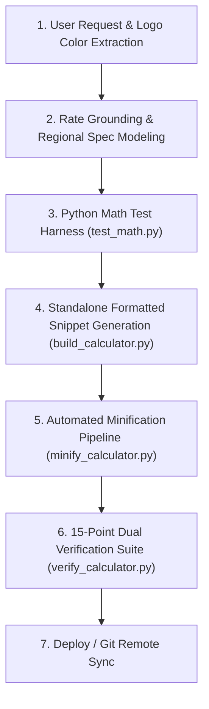

# Global WordPress Cost Calculator Builder Skill

This skill provides an autonomous end-to-end framework to build high-converting, localized, standalone WordPress cost calculator widgets for any trade, service, product, or industry (roofing, masonry, concrete, HVAC, plumbing, solar, remodeling, commercial services).

---

## 1. Mandatory Design & Branding Directives (STRICT ENFORCEMENT)

When creating, updating, or generating any WordPress cost calculator, ALWAYS enforce the following strict rules:

### A. Deep Logo Color Analysis & Dual-Color Harmony
- **Visual Inspection**: Thoroughly inspect the target website's logo image and extract the exact primary and secondary color palette (Hex codes).
- **Brand System Mapping**:
  - **Primary Logo Color**: Apply to primary action buttons, active tab/segmented pill backgrounds, header titles, focus borders, main breakdown bar segments, and quote card borders.
  - **Secondary Logo Color**: Apply to badges, highlight accents, active tab borders/indicators, legend tags, click-to-call CTA buttons, and secondary action elements.

### B. Centered Header Section (STRICT MANDATE)
- **Centering (Universal)**: The entire header block (Location Badge, Main Calculator Title, and Subtitle) **MUST ALWAYS be centered** (`text-align: center; margin: 0 auto;`).
- **Location Badge**: Display a sleek, centered location/market badge above the main title:
  ```html
  <div class="bcc-badge">Bellevue, NE &bull; Sarpy County</div>
  ```
  ```css
  .bcc-badge {
    display: inline-block !important;
    margin: 0 auto 8px auto !important;
    text-align: center !important;
    background: rgba(0, 74, 173, 0.08) !important;
    color: var(--bcc-primary) !important;
    border: 1px solid rgba(0, 74, 173, 0.2) !important;
    padding: 4px 12px !important;
    border-radius: 9999px !important;
    font-size: 11px !important;
    font-weight: 700 !important;
    text-transform: uppercase !important;
    letter-spacing: 0.05em !important;
  }
  ```
- **Main Calculator Title**: Centered headline (`<h2 class="bcc-title">...</h2>` with `text-align: center !important; margin: 0 auto 6px auto !important; font-size: 24px–28px; font-weight: 800;`).
- **Subtitle**: Centered technical summary/badge line (`<p class="bcc-subtitle">...</p>` with `text-align: center !important; margin: 0 auto !important; font-size: 12px–13px; color: var(--bcc-text-muted);`).
- **Forbidden**: NEVER left-align or right-align the top calculator header title, badge, or subtitle block.

### C. Calculator Container Background (STRICT MANDATE)
- **Background Color**: You MUST **ONLY use `#FFFFFF`** (Pure White) as the background color code for all calculator containers (`background: #FFFFFF;` or `--card-bg: #FFFFFF;`).
- **Forbidden**: NEVER use grey (`#F8FAFC`, `#F1F5F9`), dark, or tinted backgrounds for the main calculator container box.

### D. Universal Container Bounds
- **Container Max-Width**: Default MUST ALWAYS be `max-width: 100%` for fluid, flawless responsive rendering across PC header right areas, sidebars, body contents, and mobile viewports.

---

## 2. Input Form Controls & Layout Best Practices

### A. Concise, Unclipped Dropdown Options (< 35 Characters)
In narrow hero right columns or sidebar containers (~280px–340px), verbose dropdown option labels get truncated with `...` by the browser.
- **Rule**: Keep all `<option>` text concise, plain-English, and under 35 characters so the label is 100% visible before the dropdown arrow.
- **Examples**:
  - `1-Car (~240 sq ft)` (18 chars)
  - `2-Car Standard (~480 sq ft)` (28 chars)
  - `2-Car Oversized (~640 sq ft)` (29 chars)
  - `3-Car (~900 sq ft)` (18 chars)
  - `Custom Area (Enter sq ft)` (25 chars)
  - `Broom Finish (Standard)` (23 chars)
  - `Smooth Trowel (Clean Flat)` (26 chars)
  - `Exposed Aggregate (Textured)` (28 chars)
  - `Stamped Concrete (Decorative)` (29 chars)

### B. Dropdown-First Surface Area Pattern & Hidden-by-Default Custom Stepper
- **Surface Area as Dropdown**: When collecting area or project scope, prefer an all-dropdown interface over horizontal chip buttons. In narrow hero right columns (~280px–360px), multi-button chip rows get squeezed and truncate into unreadable fragments.
- **Custom Stepper Hidden by Default Protocol**:
  - Provide standard scope options with clear square footage benchmarks.
  - Include a `Custom Area (Enter sq ft)` option that smoothly toggles a numeric stepper `[-] [ 480 ] sq ft [+]` directly below the dropdown.
  - In CSS:
    ```css
    .bcc-stepper-wrap {
      display: none;
      align-items: center;
      gap: 8px;
      margin-top: 8px;
      background: #F8FAFC;
      border: 1px dashed #CBD5E1;
      border-radius: 8px;
      padding: 8px 10px;
    }
    .bcc-stepper-wrap.bcc-stepper-active {
      display: flex !important;
    }
    .bcc-stepper-btn {
      all: unset !important;
      box-sizing: border-box !important;
      width: 38px !important;
      height: 38px !important;
      min-width: 38px !important;
      max-width: 38px !important;
      background: #FFFFFF !important;
      border: 1.5px solid var(--bcc-border) !important;
      border-radius: 6px !important;
      display: flex !important;
      align-items: center !important;
      justify-content: center !important;
      cursor: pointer !important;
      font-size: 18px !important;
      font-weight: 700 !important;
      color: var(--bcc-primary) !important;
      transition: all 0.15s ease !important;
      user-select: none !important;
    }
    .bcc-stepper-btn:hover {
      background: var(--bcc-primary) !important;
      color: #FFFFFF !important;
      border-color: var(--bcc-primary) !important;
    }
    ```
  - In HTML:
    ```html
    <div id="bcc-stepper-wrap" class="bcc-stepper-wrap">
      <button type="button" class="bcc-stepper-btn" onclick="bccStepSqft(-25)" aria-label="Decrease square footage">&minus;</button>
      <div class="bcc-input-wrap">
        <input type="number" id="bcc-sqft-input" class="bcc-input" value="480" min="50" max="10000" step="10" oninput="bccOnCustomSqftInput()">
        <span class="bcc-input-suffix">sq ft</span>
      </div>
      <button type="button" class="bcc-stepper-btn" onclick="bccStepSqft(25)" aria-label="Increase square footage">&plus;</button>
      <div id="bcc-counter-pill" class="bcc-counter-pill">480 Sq Ft</div>
    </div>
    ```
  - In JavaScript:
    ```javascript
    window.bccOnPresetChange = function() {
      var preset = document.getElementById('bcc-size-preset').value;
      var stepperWrap = document.getElementById('bcc-stepper-wrap');
      var sqftInput = document.getElementById('bcc-sqft-input');
      
      if (preset === 'custom') {
        if (stepperWrap) {
          stepperWrap.classList.add('bcc-stepper-active');
          stepperWrap.style.setProperty('display', 'flex', 'important');
        }
      } else {
        if (stepperWrap) {
          stepperWrap.classList.remove('bcc-stepper-active');
          stepperWrap.style.setProperty('display', 'none', 'important');
        }
        sqftInput.value = preset;
      }
      bccCalculate();
    };

    window.bccStepSqft = function(delta) {
      var sqftInput = document.getElementById('bcc-sqft-input');
      var val = parseFloat(sqftInput.value) || 480;
      val = Math.max(50, Math.min(10000, val + delta));
      sqftInput.value = val;
      bccCalculate();
    };
    ```

### C. 2-Column Responsive Anti-Truncation Grid Mandate
In hero columns and sidebars (~440px–600px wide), NEVER use a 3-column dropdown row (`repeat(3, 1fr)`), which squashes dropdowns into ~140px width and forces text to truncate.
- Enforce a balanced **2-column grid**:
  ```css
  .bcc-grid-2col {
    display: grid;
    grid-template-columns: 1fr;
    gap: 14px;
  }
  @media (min-width: 440px) {
    .bcc-grid-2col {
      grid-template-columns: repeat(2, 1fr) !important;
      gap: 12px 14px !important;
    }
  }
  ```
- Each dropdown receives 240px+ of width, ensuring 100% full text visibility without any truncation. Automatically collapses to 1 column on narrow mobile screens (< 440px).

### D. Elementor & WordPress Theme-Immune Dropdowns (STRICT ANTI-CLIPPING MANDATE)
Themes like Astra, Divi, and Elementor inject fixed heights (e.g. `height: 38px !important;` or `height: 40px;`) onto `<select>` and `<input>`. Applying vertical padding (`padding: 12px ... 12px`) pushes the text down so that the bottom half of the letters is cut off!
- **Mandatory Anti-Clipping Rule**:
  - Always enforce **ZERO vertical padding** (`padding: 0 36px 0 12px !important;`).
  - Set explicit matching height and line-height: `height: 42px !important; min-height: 42px !important; max-height: 42px !important; line-height: 40px !important;`.
  - Always specify `box-sizing: border-box !important; vertical-align: middle !important; display: block !important; overflow: hidden !important; text-overflow: ellipsis !important;`.
  - This guarantees 100% vertical centering and eliminates text clipping across all themes.

---

## 3. Results Architecture: Lightbox Modal Pop-Up Protocol

When the user requests a pop-up modal or lightbox results window, enforce the following architecture:

### A. Anti-Cascade Specificity Protocol (CRITICAL FIX FOR "RESULTS NOT SHOWING")
- **NEVER use inline `style="display: none !important;"` on the overlay HTML tag**:
  - In W3C CSS cascading specificity, an inline style with `!important` (specificity 1-0-0-0) completely overrides any stylesheet rule.
  - An inline `display: none !important;` will permanently trap the modal in a hidden state, causing user clicks on "Calculate Estimate" to fail silently.
- **Mandatory Clean HTML Tag**:
  ```html
  <div id="bcc-results-modal" class="bcc-modal-overlay" onclick="bccOnBackdropClick(event)">
  ```
- **Mandatory Base CSS**:
  ```css
  #bcc-results-modal,
  .bcc-modal-overlay {
    display: none !important; /* STRICT: Hidden by default */
    position: fixed !important;
    top: 0 !important;
    left: 0 !important;
    width: 100vw !important;
    height: 100vh !important;
    background: rgba(15, 23, 42, 0.72) !important;
    backdrop-filter: blur(4px) !important;
    -webkit-backdrop-filter: blur(4px) !important;
    z-index: 99999999 !important;
    align-items: center !important;
    justify-content: center !important;
    padding: 12px !important;
    box-sizing: border-box !important;
  }

  #bcc-results-modal.bcc-modal-active,
  .bcc-modal-overlay.bcc-modal-active {
    display: flex !important;
    animation: bccFadeIn 0.2s ease-out forwards !important;
  }
  ```
- **Mandatory JavaScript Launch & Dismiss Pattern**:
  ```javascript
  // On Launch:
  var modal = document.getElementById('bcc-results-modal');
  if (modal) {
    modal.style.removeProperty('display');
    modal.style.setProperty('display', 'flex', 'important');
    modal.classList.add('bcc-modal-active');
    startCountdown();
  }
  document.body.style.overflow = 'hidden';

  // On Dismiss:
  var modal = document.getElementById('bcc-results-modal');
  if (modal) {
    modal.classList.remove('bcc-modal-active');
    modal.style.removeProperty('display');
    modal.style.setProperty('display', 'none', 'important');
    stopCountdown();
  }
  document.body.style.overflow = '';
  ```

### B. Dynamic Cost Bar Allocation Recalculation
- Dynamically calculate and set percentage widths (`%`) on the breakdown segments (`Concrete Pour`, `Demolition`, `Prep/Permits`):
  ```javascript
  var total = currentCalc.grandTotal;
  var pConcrete = Math.max(5, (currentCalc.concreteTotal / total) * 100);
  var pDemo = (currentCalc.demoTotal / total) * 100;
  var pPrep = (currentCalc.prepTotal / total) * 100;

  if (barConcrete) barConcrete.style.width = pConcrete + '%';
  if (barDemo) barDemo.style.width = pDemo + '%';
  if (barPrep) barPrep.style.width = pPrep + '%';
  ```

### C. Astra / WordPress Theme-Immune Close Button
Themes like Astra inject global styles onto `<button>` elements (`padding: 15px 30px; border-radius: 4px; font-size: 16px;`). To guarantee a pristine circular close button:
```css
#bcc-results-modal .bcc-close-btn,
button.bcc-close-btn,
.bcc-close-btn {
  all: unset !important;
  box-sizing: border-box !important;
  position: absolute !important;
  top: 10px !important;
  right: 10px !important;
  width: 30px !important;
  height: 30px !important;
  min-width: 30px !important;
  max-width: 30px !important;
  min-height: 30px !important;
  max-height: 30px !important;
  padding: 0 !important;
  margin: 0 !important;
  background: #F1F5F9 !important;
  border: 1.5px solid #CBD5E1 !important;
  border-radius: 50% !important;
  display: inline-flex !important;
  align-items: center !important;
  justify-content: center !important;
  cursor: pointer !important;
  color: #1E293B !important;
  transition: all 0.18s ease !important;
  z-index: 10 !important;
}

.bcc-close-btn:hover {
  background: #E2E8F0 !important;
  color: #0F172A !important;
  transform: rotate(90deg) scale(1.05) !important;
}
```

### D. 5-Second Auto-Close Countdown with Hover Pause
- Top countdown progress bar shrinks from 100% to 0% over 5 seconds (5000ms).
- `onmouseenter="bccPauseTimer()"` pauses the countdown when the user hovers over the dialog.
- `onmouseleave="bccResumeTimer()"` resumes the countdown.
- Dismissible via click on backdrop overlay and `Escape` key listener.

### E. Mobile & Tablet Modal Viewport Fit Protocol
- **Total Modal Height Mandate**: Keep mobile modal height compact (**~358px–380px** total) so 100% of the popup—including specifications table and conversion buttons—fits on screen without clipping or forced scrolling.
- **Dual Side-by-Side Mobile CTAs**: NEVER stack action buttons into a single 1-column layout on mobile. Always enforce **side-by-side dual buttons** (`grid-template-columns: 1fr 1fr !important; gap: 8px;`) for primary actions ("Get Free Quote" alongside direct phone number).
- **Compact Specs Table & Allocation Bar**: Cell padding `2.5px 6px` and font size `10px` on mobile (< 600px).
- **Circular Close Button**: Sized to `26px × 26px` with `top: 8px; right: 8px;` on mobile for effortless fingertip closing.

---

## 4. Isolated 1-Page PDF Print Engine (`bccPrintEstimate`)

Calling generic `window.print()` from a WordPress / Elementor page prints website clutter and splits the estimate card across pages. 

### Implementation Standard:
When the user clicks "Print PDF", dynamically inject an isolated print document into a hidden `<iframe>`:
```javascript
window.bccPrintEstimate = function() {
  var printHtml = '<!DOCTYPE html><html><head><meta charset="utf-8">' +
    '<title>Official Estimate - ' + currentCalc.grandTotal.toLocaleString() + ' USD</title>' +
    '<style>' +
    '@page { size: letter portrait; margin: 12mm 14mm; }' +
    '* { box-sizing: border-box; font-family: -apple-system, BlinkMacSystemFont, "Segoe UI", Roboto, Arial, sans-serif; }' +
    'body { margin: 0; padding: 0; color: #1B2942; background: #FFFFFF; font-size: 12px; line-height: 1.4; }' +
    '.quote-card { border: 2px solid #004AAD; border-radius: 8px; padding: 22px 24px; max-width: 680px; margin: 0 auto; }' +
    '/* Clean header, specs table, hero price box, itemized breakdown, and contact footer */' +
    '</style></head><body>' +
    '<div class="quote-card">' +
      '<!-- Clean 1-Page Quote Body -->' +
    '</div></body></html>';

  var printFrame = document.getElementById('bcc-print-iframe');
  if (!printFrame) {
    printFrame = document.createElement('iframe');
    printFrame.id = 'bcc-print-iframe';
    printFrame.style.position = 'fixed';
    printFrame.style.right = '0';
    printFrame.style.bottom = '0';
    printFrame.style.width = '0';
    printFrame.style.height = '0';
    printFrame.style.border = '0';
    document.body.appendChild(printFrame);
  }

  var frameDoc = printFrame.contentWindow || printFrame.contentDocument;
  if (frameDoc.document) frameDoc = frameDoc.document;
  frameDoc.open();
  frameDoc.write(printHtml);
  frameDoc.close();

  setTimeout(function() {
    printFrame.contentWindow.focus();
    printFrame.contentWindow.print();
  }, 250);
};
```
- **Guaranteed Output**: Exactly **Page 1 of 1** letter-sized PDF estimate.
- **Omission**: Automatically strips the close button, countdown bar, and website chrome.

---

## 5. Direct Conversion CTA Group

In the results modal / output card, provide high-converting lead actions:
1. **Contact Us Button**: Direct link to the client's booking or contact page (e.g., `https://[client-domain]/contact-us/`).
2. **Direct Phone Call Button**: One-tap phone link (`tel:[phone]`).
3. **Print PDF Button**: One-click 1-page estimate generator.

---

## 6. 100% Valid Single-Root JSON-LD Schema Architecture

Every generated calculator MUST include a complete `@graph` JSON-LD schema with zero errors and zero warnings:
1. `WebSite`: Canonical site root.
2. `WebPage`: Hosted page containing the tool (`about` pointing to organization).
3. `WebApplication` / `SoftwareApplication`: Tool declaration with `$0.00` Free Online Utility offer, `aggregateRating`, and `featureList`.
4. `Service`: Specific trade service entity with disambiguated `areaServed` (Wikipedia and Wikidata Q-IDs).
5. `GeneralContractor` (or specific trade `@type`): Fully populated provider entity with phone, address, geo coordinates, opening hours, and official Google Knowledge Graph / Maps `sameAs` links.

---

## 7. Standard Operational Workflow



### Step 1: Web Search & Rate Grounding
Extract hourly labor rates, material square foot pricing, and local permit fees for the target market.

### Step 2: Math Verification Harness
Verify formula calculations using a Python test harness before generating HTML:
$$\text{Total} = \left[ \left(\text{Quantity} \times \text{Material Rate} \times \text{Multiplier}\right) \times \text{Regional Factor} \right] + \text{Demolition} + \text{Prep} + \text{Permits}$$

### Step 3: Standalone Code Generation
Produce clean, self-contained HTML/CSS/JS without external CDN dependencies. Enforce the anti-cascade specificity rules (no inline `display: none !important;`).

### Step 4: Automated Minification Pipeline
Write a Python script to compress HTML, CSS, and JS into a copy-and-paste single block for WordPress Gutenberg / Elementor HTML widgets.

### Step 5: 15-Point Dual Verification Suite (`verify_calculator.py`)
Run automated assertions across both the formatted snippet and the minified production file:
1. **Centered Header Block**: Location badge, main title, and subtitle strictly centered (`text-align: center; margin: 0 auto;`).
2. **Container Background**: Strictly `#FFFFFF` (Pure White).
3. **Universal Container Bounds**: Default `max-width: 100%`.
4. **Concise Dropdown Options**: All `<option>` labels strictly under 35 characters.
5. **Theme-Immune Dropdowns**: Height 42px, line-height 40px, zero vertical padding.
6. **Anti-Cascade Specificity**: Modal overlay clean HTML tag with zero inline `display: none` blocking.
7. **Modal Active State**: `.bcc-modal-active` with `display: flex !important` and backdrop blur.
8. **Astra-Immune Close Button**: `all: unset !important; border-radius: 50% !important;` 30px x 30px circular button.
9. **5-Second Countdown Timer**: Progress bar shrinks from 100% to 0% over 5s with `bccPauseTimer` hover pause.
10. **Direct Lead CTAs**: Verified links directly to `/contact-us/` and `tel:[phone]`.
11. **Isolated 1-Page PDF Engine**: `bccPrintEstimate` generates isolated 1-page letter PDF via hidden `<iframe>`.
12. **100% Valid JSON-LD Schema**: Includes `WebSite`, `WebPage`, `WebApplication`, `Service`, and `GeneralContractor`.
13. **Hidden Stepper Protocol**: `.bcc-stepper-wrap` hidden by default; toggles active only on custom entry.
14. **2-Column Responsive Grid**: Balanced 2-column layout on viewports $\ge$ 440px to eliminate text clipping.
15. **Both Files Validated**: 100% pass across formatted snippet AND minified production file.
