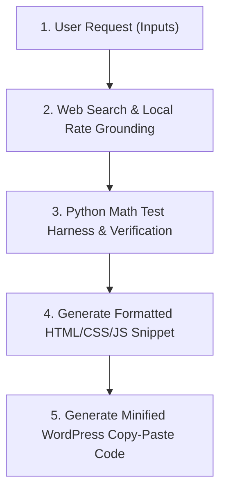

# WordPress Cost Calculator Builder Skill

This skill provides an autonomous end-to-end framework to build high-converting, localized, standalone WordPress cost calculator widgets for any trade, service, or product.

---

## 1. Minimal User Inputs Required

When the user provides minimal input (or when prompting for instructions), extract or request the following 5 key variables:

| Input Variable | Description / Example | Default Value (If Unspecified) |
| :--- | :--- | :--- |
| **Location** | City, Zip, or Region (e.g., `Grass Valley, CA`) | `Grass Valley, CA` (COLA: 1.15x) |
| **Calculator Keyword** | Target SEO Keyword (e.g., `Shower Enclosure Installation Cost Calculator`) | Prompt or infer from user context |
| **Color Palette** | 3 Primary Hex Codes (Header/Button, Background, Text) | `#0085CA` (Blue), `#FFFFFF` (White BG), `#000000` (Black Text) |
| **Font Family** | Google Font or standard font stack for headings & body | `'Oxygen', sans-serif` |
| **Container Width** | Max-width constraint for fluid responsive layout | `max-width: 100%` |

---

## 2. Standard Operational Workflow

Follow this 5-step workflow every time a new calculator keyword is requested:



### Step 1: Web Search & Local Rate Grounding
Use `search_web` to retrieve localized cost metrics for the target keyword in the specified location:
- Local Trade Labor Hourly Rate (e.g., Glazier/Electrician/Plumber labor baseline).
- Material Unit Rates (Base materials, premium tiers, addons).
- Local Building Codes & Climate Standards (e.g., California Title 24, Seismic Zone 4, Wind/Hail ratings).
- Ancillary Fees (Demolition, disposal, permits, specialized rigging/equipment).

### Step 2: Math Verification via Python Test Harness
Create a python script in scratch (e.g., `verify_[service]_calculator.py`) using `write_to_file`, then execute it using `run_command`:
- Verify all formula outputs, range bounds (Min: -10%, Max: +12%), unit subtotals, and edge cases.
- Confirm Exit Code 0 before generating frontend HTML code.

### Step 3: Standalone WordPress Code Generation (`-snippet.html`)
Build a 100% self-contained module containing:
1. **HTML Structure**: Card container, header with location badge, user input controls (range sliders, preset button grid, drop-down selects, feature checkboxes), primary calculate button, detailed cost results card, and footer.
2. **CSS Design Tokens**: Scoped classes (e.g., `.gv-[service]-calc-wp`), `Oxygen` typography, `#FFFFFF` crisp card background, `#0085CA` accent headers/buttons, `#000000` high-contrast borders and text, fluid `max-width: 100%`.
3. **Vanilla JS Engine**: Multi-vector math engine, DOM listener bindings, `renderResults()` formatter, stacked bar calculation.

### Step 4: Mandatory Interactive Auto-Close Results Box
The results box (`#gv[Service]ResultsBox`) **MUST** implement the 5-second auto-close/minimize feature:
- Initial state: `style="display: none;"`
- Trigger: Clicking **"🧮 Calculate [Service] Cost"** displays the card, scrolls it smoothly into view, and starts a 5-second `setInterval` countdown.
- Countdown Badge: Displays `⏱️ Auto-closing in Xs`.
- Hover Pause: `mouseenter` event clears the interval and updates badge to `⏸️ Timer paused (Reading)`. `mouseleave` resumes countdown.
- Manual Close: Includes a `✖ Minimize / Close` link that hides the results card and clears timers.

### Step 5: Automated Minification Pipeline (`-minified.html`)
Write a python minification script (e.g., `minify_[service].py`) that strips comments and unnecessary whitespace from HTML, CSS, and JS without breaking execution. Run it via `run_command` and present both Option 1 (Minified Code) and Option 2 (Formatted Code) to the user.

---

## 3. Standardized Multi-Vector Pricing Formula

$$\text{Total Investment} = \left[ \left( \text{Base Material Rate} \times \text{Quantity/Area} + \text{Addons} \right) + \left( \text{Labor Hours} \times \text{Labor Rate} \right) + \text{Fees} \right] \times \text{Regional COLA Multiplier}$$

Where:
- **Min Estimate**: $\text{Total} \times 0.90$
- **Max Estimate**: $\text{Total} \times 1.12$
- **Unit Metric**: $\text{Total} / \text{Quantity or Sq.Ft.}$

---

## 4. Output Deliverable Formatting Guide

When presenting the output to the user, always provide:
1. **Option 1: Compressed / Minified WordPress Code**: Wrapped in a single ````html ```` block ready for copy-pasting into Gutenberg / Elementor / Divi.
2. **Option 2: Formatted Code**: Cleanly indented code with inline comments for users who wish to customize field options or pricing constants.
3. **Local Scratch File References**: Links to `[service]-snippet.html` and `[service]-minified.html`.
